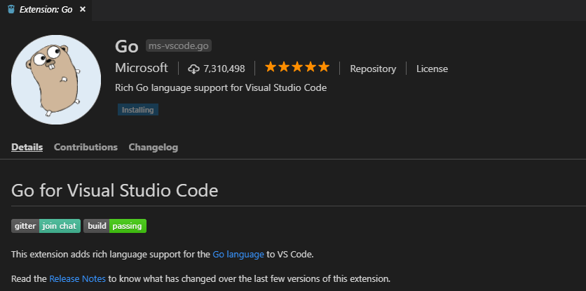
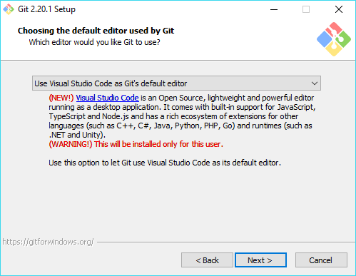

# Quick Start Guide: Rubrik SDK for Go

## Introduction to the Rubrik SDK for Go

Rubrik's API first architecture enables organizations to embrace and integrate Rubrik functionality into their existing automation processes. While Rubrik APIs can be consumed natively, companies are at various stages in their automation journey with different levels of automation knowledge on staff. The Rubrik Software Development Kit (SDK) for Go extends upon Go's robust programming language, transforming Rubrik functionality into easy to consume functions. This eliminates the need to understand how to consume raw Rubrik APIs with Go and extends upon one of Rubrik's main design centers - simplicity.

## Authentication Mechanisms

The Rubrik SDK for Go provides two methods for connecting to your Rubrik cluster:

- `ConnectEnv()` - accesses credentials through the use of environment variables
- `Connect(nodeIP string, username string, password string)` - credentials are passed to the function  as parameters.

### Authenticating with Environment Variables

Storing credentials in environment variables is a more secure process than storing them in your source code, and it ensures that your credentials are not accidentally shared if your code is uploaded to an internal or public version control system such as GitHub. When calling rubrikcdm.Connect(), it will attempt to read the Rubrik Cluster credentials from the following environment variables:

* **rubrik_cdm_node_ip** (Contains the IP/FQDN of a Rubrik node)
* **rubrik_cdm_token** (Contains an API Token with configured access to the Rubrik cluster. The token will always take precedence over rubrik_cdm_username and rubrik_cdm_password)
* **rubrik_cdm_username** (Contains a username with configured access to the Rubrik cluster)
* **rubrik_cdm_password** (Contains the password for the above user).

The way in which to populate these environment variables differs depending on the operating you are executing your code on. Below are examples for Windows, Linux, and Mac OS.

#### Setting Environment Variables in Microsoft Windows

For Microsoft Windows-based operating systems the environment variables can be set utilizing the setx command as follows:

```
setx rubrik_cdm_node_ip "192.168.0.100"
setx rubrik_cdm_token "ajw02322jfj22sl3"

```
setx rubrik_cdm_node_ip "192.168.0.100"
setx rubrik_cdm_username "user@domain.com"
setx rubrik_cdm_password "SecretPassword"
```
```

Run set without any other parameters to view current environment variables. Using setx saves the environment variables permanently, and the variables defined in the current shell will not be available until a new shell is opened. Using set instead of setx will define variables in the current shell session, but they will not be saved between sessions.

#### Setting Environment Variables in macOS and \*nix

For macOS and \*nix based operating systems the environment variables can be set utilizing the export command as follows:

```
export rubrik_cdm_node_ip=192.168.0.100
export rubrik_cdm_token "ajw02322jfj22sl3"
```

```
export rubrik_cdm_node_ip=192.168.0.100
export rubrik_cdm_username=user@domain.com
export rubrik_cdm_password=SecretPassword
```

Run export without any other parameters to view current environment variables. In order for the environment variables to persist across terminal sessions, add the above three export commands to the `~\.bash_profile` or `~\.profile` file and then run `source ~\.bash_profile` or `source ~\.profile` to ensure the environment variables are present in your current terminal session.

Once set, the `rubrikcdm.ConnectEnv()` function will automatically utilize the data within the environment variables to perform its connection.

Authenticate by Providing Username and Password

Although the use of environment variables are recommended, there may be scenarios where directly sending credentials to the `rubrikcdm.Connect()` or `rubrikcdm.ConnectAPIToken` function as parameters makes sense. To pass connection and credential information, simply call the `rubrikcdm.Connect()` function, passing the node IP, username, and password as follows:

```
nodeIp := "192.168.0.100"
username := "user@domain.com"
password := "SecretPassword"

rubrik := rubrikcdm.Connect(nodeIp, username, password)
```

```
nodeIp := "192.168.0.100"
apiToken := "ajw02322jfj22sl3"

rubrik := rubrikcdm.ConnectAPIToken(nodeIp, apiToken)
```

## Connecting to a Rubrik Cluster

The Rubrik SDK for Go utilizes the `rubrikcdm.Connect()`, `rubrikcdm.ConnectAPIToken()`, or `rubrikcdm.ConnectEnv()` functions as a mechanism to provide credentials to the Rubrik CDM. `Connect()`, `ConnectAPIToken()` or `ConnectEnv()` only needs to be called once. Connecting returns a `struct`, which should be stored in a variable to be used for subsequent calls throughout the remainder of the Go program.

| Note: The following examples use `ConnectEnv().` Using `Connect()` is functionally equivalent. |
| --- |

To initiate the function, first import the rubrikcdm package and assign the response of `rubrikcdm.ConnectEnv()` to a variable as follows:

```go
import "github.com/rubrikinc/rubrik-sdk-for-go/rubrikcdm"
rubrik, err := rubrikcdm.ConnectEnv()
```
Any error returned by the `ConnectEnv()` function will be stored in the `err` variable. Error handling code is demonstrated in the sample code below.

| Note: You may use any variable name to connect to the Rubrik cluster. |
| --- |

Any subsequent calls to methods or functions within the rubrikcdm package are now executed through the context of the variable used to store the response from the ConnectEnv() method. For example, to retrieve the VMware VMs within the Gold SLA Domain the following code is used:

```go
import "fmt"
import "github.com/rubrikinc/rubrik-sdk-for-go/rubrikcdm"

rubrik := rubrikcdm.ConnectEnv()
fmt.Println(rubrik.GetSLAObjects("Gold","VMware"))
```

For a full list of functions, methods, and their associated arguments see the official [Rubrik SDK for Go documentation](https://godoc.org/github.com/rubrikinc/rubrik-sdk-for-go/rubrikcdm).

## Rubrik SDK for Go Quick Start

The following section outlines how to get started using the Rubrik SDK for Go, including installation, configuration, as well as sample code.

### Prerequisites

The following are the prerequisites in order to successfully install and run the sample code included in this quick start guide:

* [Go](https://golang.org/doc/install)
* Rubrik CDM

### Installation

The Rubrik SDK for Go can be installed using the go get command. This installation method will take care of downloading and installing all dependencies of the Rubrik SDK for Go.

```
go get github.com/rubrikinc/rubrik-sdk-for-go/rubrikcdm
```

### Sample Syntax - VMware Virtual Machine Operations

The following code will walk through a number of real-world examples of protecting and restoring VMware Virtual Machines. For a complete listing of available functionality see the complete [Rubrik SDK for Go documentation](https://godoc.org/github.com/rubrikinc/rubrik-sdk-for-go/rubrikcdm).

#### Setting up the Sample Workflow

Follow the instructions in "Authenticating with Environment Variables" to set variables needed for the `ConnectEnv()` function. Create a file named `vmwarevms.go` in your working directory and copy in the following code. Adjust the variables as needed to work in your environment.

```go
package main

import (
	"fmt"
	"log"

	"github.com/rubrikinc/rubrik-sdk-for-go/rubrikcdm"
)

func main() {

	// Establish a connection to the Rubrik cluster
	rubrik, err := rubrikcdm.ConnectEnv()

	// Check for error conditions
	if err != nil {
		log.Fatal(err)
	}

	/*=============================================================
	  Example of protecting a VMware Virtual Machine
	 =============================================================*/

	// Set Function Variables
	objectName := "vm01"
	objectType := "vmware"
	slaName := "Gold"

	// Assign VM to SLA Domain
	_, err = rubrik.AssignSLA(objectName, objectType, slaName)

	// Check for error conditions
	if err != nil {
		log.Fatal(err)
	}

	/*===========================================================
	  Example of taking an On-Demand Snapshot of a VMware VM
	  ===========================================================*/

	// Set Function Variables
	vmName := "vm02"
	objectType = "vmware"
	slaName = "current"

	// Take On-Demand Snapshot of VM
	_, err = rubrik.OnDemandSnapshotVM(vmName, objectType, slaName)

	// Check for error conditions
	if err != nil {
		log.Fatal(err)
	}

	/*============================================================
	  Example using a GET API call to obtain VM info
	  ===========================================================*/

	vmName = "vm03"
	objectType := "vmware"
	timeOut := 30
	hostOS := "Windows"

	// Get VM Object ID
	vmID, err := rubrik.ObjectID(vmName, objectType, timeOut, hostOS)

	// Check for error conditions
	if err != nil {
		log.Fatal(err)
	}

	// Create the API endpoint address based on VM ID
	apiPath := fmt.Sprintf("/VMware/vm/%s", vmID)

	// Send the GET request via API and save the response
	vmInfo, err := rubrik.Get("v1", apiPath)

	// Check for error conditions
	if err != nil {
		log.Fatal(err)
	}

	// Loop through the API response and print desired values
	for key, value := range vmInfo.(map[string]interface{}) {
		switch t := value.(type) {
		case string:
			fmt.Printf("%v: %v\n", key, t)
		case float64:
			fmt.Printf("%v: %v\n", key, t)
		case bool:
			fmt.Printf("%v: %v\n", key, t)
		}
	}
}
```

#### Breaking Down the Sample Workflow

After importing the needed modules and connecting to the Rubrik cluster, the main examples start on Line 8.

**Lines 20 through 35** show an example of associating an existing SLA Domain with a VMware VM. The `AssignSLA()` function is utilized to accomplish this, taking in three arguments; the VM name, Object Type (VMware), and SLA Domain name.

**Lines 37 through 52** illustrates performing an on-demand snapshot of a VMware VM. The `OnDemandSnapshotVM()` function is utilized to accomplish this, taking in three arguments; the VM name, object type (VMware), and SLA Domain name to apply to the snapshot.

**Lines 54 through 90** obtains the ID of a VM protected by Rubrik, and uses the `Get()` function to gather details about the VM. A for loop is used to iterate through the API response and display details about the VM to the user.

#### Running the Sample Workflow

Once `vmwarevms.go` is saved within the working directory execute the code with the following statement:

```
go run vmwarevms.go
```

#### Accessing the Built-in Sample Code

To help accelerate development the Rubrik SDK for Go source contains many files containing common activities often performed against a Rubrik cluster. Sample code may be found on the [Rubrik SDK for Go GitHub page](https://github.com/rubrikinc/rubrik-sdk-for-go/blob/master/rubrikcdm/examples_test.go).

Paste the desired code into a new file, in this case named `samplefile.go`. Sample code may be executed using the following syntax

```
go run samplefile.go
```

## Rubrik SDK for Go Documentation

This guide acts only as a quick start to get up and running with the Rubrik SDK for Go. For detailed information on all of the functions and features included see the complete [Rubrik SDK for Go documentation](https://godoc.org/github.com/rubrikinc/rubrik-sdk-for-go/rubrikcdm).

## API Documentation

The Rubrik SDK for Go supports much of the functionality available within the Rubrik CDM. That said, the release cycles between the SDK and Rubrik CDM are not simultaneous. This means there may be times when new features or enhancements are added to the product but methods and functions to utilize them may be missing from the SDK. In these situations Go may be used to make native calls to Rubrik's RESTful API. The following syntax outlines a common piece of Rubrik functionality, assigning a VM to an SLA Domain, however, it does so by sending API requests to Rubrik CDM utilizing the `rubrikcdm.Get()` and `rubrikcdm.Patch()` functions:

```go
package main

import (
	"log"

	"github.com/rubrikinc/rubrik-sdk-for-go/rubrikcdm"
)

func main() {
	// Establish a connection to the Rubrik cluster
	rubrik, err := rubrikcdm.ConnectEnv()

	// Check for error conditions
	if err != nil {
		log.Fatal(err)
	}

	vmName := "vm01"
	slaName := "Gold"
	apiPath1 := "/VMware/vm?name=" + vmName
	apiPath2 := "/sla_domain?name=" + slaName

	// Perform a GET to obtain the VM ID
	response1, err := rubrik.Get("v1", apiPath1)

	// Check for error conditions
	if err != nil {
		log.Fatal(err)
	}

	vmID := response1.(map[string]interface{})["data"].([]interface{})[0].(map[string]interface{})["id"]

	// Perform a GET to obtain the SLA ID
	response2, err := rubrik.Get("v1", apiPath2)

	// Check for error conditions
	if err != nil {
		log.Fatal(err)
	}

	slaID := response2.(map[string]interface{})["data"].([]interface{})[0].(map[string]interface{})["id"]

	config := map[string]string{}
	config["configuredSlaDomainId"] = slaID.(string)

	// Perform a PATCH to set the VM SLA policy
	rubrik.Patch("v1", "/VMware/vm/"+vmID.(string), config)
}
```

Rubrik prides itself upon its API-first architecture, ensuring everything available within the HTML5 interface, and more, is consumable via a RESTful API. For more information on Rubrik's API architecture and complete API documentation, please see the official Rubrik API Documentation.

## Contributing to the Rubrik SDK for Go

The Rubrik SDK for Go is hosted on a public repository on GitHub. If you would like to get involved and contribute to the SDK please follow the below guidelines. The steps below require changing your `GOPATH` environment variable. Make note of the value of the `GOPATH` variable before changing it. You will want to revert `GOPATH` to its original value once you are finished adding code to the Rubrik SDK for Go.

### Common Environment Setup - Microsoft Windows

It is suggested to use a quality editor to create and modify your Go code. Below is a list of software to install if this is your first time.

#### Microsoft Visual Studio Code editor

[Visual Studio Code](https://code.visualstudio.com/) is a lightweight but powerful source code editor which runs on your desktop and is available for Windows, macOS and Linux. It comes with built-in support for JavaScript, TypeScript and Node.js and has a rich ecosystem of extensions for other languages (such as C++, C#, Java, Python, PHP, Go) and runtimes (such as .NET and Unity).

#### Go in Visual Studio Code

Using the [Go extension for Visual Studio Code](https://code.visualstudio.com/docs/languages/go), you get language features like IntelliSense, code navigation, symbol search, bracket matching, snippets and many more that will help you in Golang development. Additionally, the use of a native lint tool helps discover and remediate syntax errors.



#### Git for Windows

[Git for Windows](https://gitforwindows.org/) focuses on offering a lightweight, native set of tools that bring the full feature set of the Git SCM to Windows while providing appropriate user interfaces for experienced Git users and novices alike.



#### Creating a Development Workspace

1. Create a new directory for development work and change to that directory
```
md dev
cd dev
```
2. Change your `GOPATH` environment variable to the current directory
```
set "GOPATH=%cd%"
```
3. Create the necessary directory structure
```
md src\github.com\rubrikinc
```
4. Change to the newly created directory
```
cd src\github.com\rubrikinc
```
5. Clone the Rubrik SDK for Go repository
```
git clone https://github.com/rubrikinc/rubrik-sdk-for-go.git
```
6. Change to the repository root directory
```
cd rubrik-sdk-for-go
```
7. Switch to the devel branch
```
git checkout devel
```

### Common Environment Setup - macOS and \*nix

1. Create a new directory for development work and change to that directory
```
md dev
cd dev
```
2. Change your GOPATH environment variable to the current directory
```
export GOPATH=`pwd`
```
3. Create the necessary directory structure
```
mkdir -p src/github.com/rubrikinc
```
4. Change to the newly created directory
```
cd src/github.com/rubrikinc
```
5. Clone the Rubrik SDK for Go repository
```
git clone https://github.com/rubrikinc/rubrik-sdk-for-go.git
```
6. Change to the repository root directory
```
cd rubrik-sdk-for-go
```
7. Switch to the devel branch
```
git checkout devel
```

### New Function Development

The `/rubrik-sdk-for-go/rubrikcdm` directory contains all functions for the SDK.

At a high level the directory contains the following:

* `client.go` -  Base API Functions (get, post, etc.) that should only be touched for bug fixes.
* `cloud.go` - Cloud related functions
* `cluster.go` - Functions involving the configuration of the Rubrik cluster itself (think Day 0 configurations)
* `data_management.go` - Functions related to Data Protection tasks (ex. On-demand snapshots)
* `examples_test.go` - Example code utilizing the SDK

When adding a new function it ideally should be categorized to fit into one of the above files. Each function should meet the following requirements:

* Each function must be idempotent. Before making any configuration changes (post, patch, delete) you should first check to see if that change is necessary. If it's not you must return a message formatted as `No change required. {message}`. For example, the `AssignSLA()` function first checks to see if the Rubrik object is already assigned to the provided SLA domain.
* A corresponding example created in `examples_test.go`.

Once a new function has been added you will then submit a new Pull Request which will be reviewed before merging into the devel branch.

For more information around contributing to the Rubrik SDK for Go see the [Rubrik SDK for Go Development Guide](https://github.com/rubrikinc/rubrik-sdk-for-go/blob/devel/CONTRIBUTING.md) documentation on GitHub.

## Further Reading

* [Rubrik SDK for Go GitHub Repository](https://github.com/rubrikinc/rubrik-sdk-for-go)
* [Rubrik SDK for Go Official Documentation](https://godoc.org/github.com/rubrikinc/rubrik-sdk-for-go/rubrikcdm)
* [Rubrik SDK for Go Development Guide (GitHub)](https://github.com/rubrikinc/rubrik-sdk-for-go/blob/devel/CONTRIBUTING.md)
* [Introducing the Rubrik SDK for Go](https://www.rubrik.com/blog/rubrik-google-go-sdk/)
